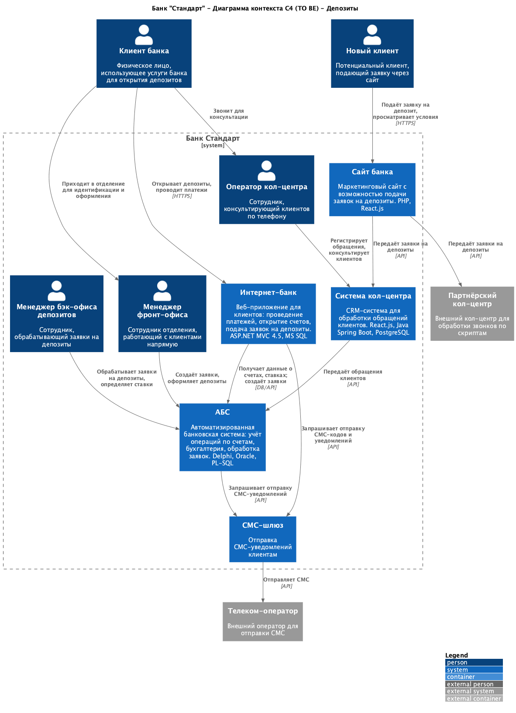
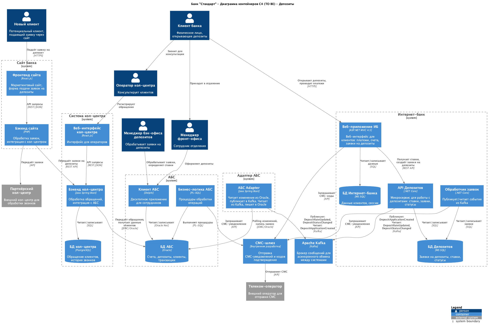

### **Название задачи:**

ADR "Открытие депозитов онлайн"

### **Автор:**

Юдин Ярослав

### **Дата:**

06.12.2025

### **Функциональные требования**

<table>
<thead>
<tr>
  <th>№</th>
  <th>Действующие лица или системы</th>
  <th>Use Case</th>
  <th>Описание</th>
  <th>Комментарий</th>
</tr>
</thead>
<tbody style="vertical-align: top;">
<tr>
  <td>UC1</td>
  <td>Клиент, сайт, менеджер, система кол-центра</td>
  <td>Заявка на депозит через сайт</td>
  <td>
    <ol style="margin: 0; padding-left: 1.2em;">
    <li>На сайте новый клиент видит список доступных депозитов с актуальными ставками.</li>
    <li>Клиент может подать заявку на депозит на сайте, оставив свой номер телефона и Ф. И. О.</li>
    <li>После подачи заявки на депозит клиенту звонит менеджер.</li>
    <li>Изучив заявку в системе кол-центра, менеджер может предложить особые условия.</li>
    <li>После звонка клиент идет в отделение для идентификации. </li>
    </ol> 
  </td>
  <td>Объединяем требования F1-F5 в один Use Case</td>
</tr>
<tr>
  <td>UC2</td>
  <td>Клиент, интернет-банк, менеджер, АБС, СМС-шлюз</td>
  <td>Заявка на депозит через интернет-банк</td>
  <td>
    <ol style="margin: 0; padding-left: 1.2em;">
    <li>В интернет-банке клиент видит список доступных депозитов с актуальными ставками и персонализированные ставки лично для него.</li>
    <li>Указав счёт и сумму депозита в интернет банке, клиент может подать заявку на открытие депозита.</li>
    <li>Заявку на открытие депозита в интернет-банке необходимо будет подтвердить с помощью СМС-кода.</li>
    <li>Заявку на открытие депозита обработает менеджер в бэк-офисе: подтвердит условия депозита в АБС банка.</li>
    <li>Клиент должен получить СМС-уведомления после подтверждения размера ставки и открытия депозита.</li>
    </ol> 
  </td>
  <td>Объединяем требования F7, F8, F9, F12, F13 в один Use Case</td>
</tr>
</tbody>
</table>

### **Нефункциональные требования**

| **№** | **Требование**                                                                                                         | **Комментарий**                                                                                                                                           |
| :---: | :--------------------------------------------------------------------------------------------------------------------- | --------------------------------------------------------------------------------------------------------------------------------------------------------- |
| **R** | **Надёжность (Reliability)**                                                                                           |
|  R1   | Все сервисы должны работать 24/7 и быть доступны в 99,9% случаев.                                                      |
|  R2   | В случае сбоев в ЦОД необходимо, чтобы сервисы интернет-банка были доступны и выдерживали требуемую нагрузку.          |
| **P** | **Производительность(Performance)**                                                                                    |
|  P1   | Отклик по всем операциям должен быть максимально быстрым и занимать миллисекунды.                                      |
|  P2   | Предусмотреть равномерное горизонтальное масштабирование и распределение запросов между серверами, приложениями и ЦОД. |
|  +R   | **+ Ограничения (Restrictions)**                                                                                       |
|  +R1  | При доработках во всех системах нужно как можно больше использовать технологии, которые уже есть в банке.              | Например, базы данных MS SQL и Oracle. Можно развернуть новые технологии, но необходимо, чтобы они были совместимы с существующими платформами разработки |
|  +R2  | Можно развернуть новые технологии, но необходимо, чтобы они были совместимы с существующими платформами разработки.    | Также желательно, чтобы внутри банка уже была экспертиза.                                                                                                 |
|  +R3  | Если нужны очереди сообщений, то лучше использовать Kafka на перспективу.                                              |                                                                                                                                                           |
|  +R4  | Cтоит учитывать, что текущая версия платформы интернет-банка несовместима с кафкой.                                    |                                                                                                                                                           |
|  +R5  | Cтоит подумать о переводе интернет-банка на микросервисную архитектуру.                                                | Пока только в рамках задачи открытия депозитов.                                                                                                           |
|  +R6  | Лучше избежать прямой работы интернет-банка с API АБС в новом процессе.                                                | База данных АБС уже перегружена.                                                                                                                          |
|  +R7  | Всё работает в одном ЦОД на одной группе серверов.                                                                     | У банка есть резервный ЦОД, в случае сбоя можно переключиться на него.                                                                                    |
|  +R8  | АБС может масштабироваться только вертикально из-за своей базы данных.                                                 |                                                                                                                                                           |
| +R11  | Обновление ядра системы интернет-банка привязано к подрядчику.                                                         |                                                                                                                                                           |
| +R12  | Система колл-центра полностью поддерживается подрядчиком.                                                              | В команде АБС есть несколько специалистов с опытом в Java-стеке, они могут иногда вносить изменения самостоятельно.                                       |
| +R13  | Команда интернет-банка утверждает, что требования по доступности пока невыполнимы.                                     |                                                                                                                                                           |
| +R14  | Интернет-банк: Клиент-серверная система на веб-фреймворке ASP.NET MVC 4.5 на основе .NET Framework 4.5 и СУБД MS SQL.  |                                                                                                                                                           |
| +R15  | АБС: Интерфейс — десктопный клиент на Delphi и СУБД на Oracle. Основная логика работы - процедуры на PL-SQL в СУБД.    |                                                                                                                                                           |
| +R16  | Система кол-центра: интерфейс на React.js, бэкенд на Java Spring Boot и базы PostgreSQL, архитектура микросервисная.   | Работает на технологиях подрядчика.                                                                                                                       |
| +R17  | Сайт: собственная разработка банка на PHP и React.js.                                                                  |                                                                                                                                                           |

### **Решение**

#### Диаграмма контекста

#### Диаграмма контейнеров

1. **+R1, +R2** — используем уже используемые технологии (.NET, MS SQL), т.к. на данный момент они удовлетворяют нашим требованиям.
2. **+R6** — создаём новый микросервис в рамках интернет-банка, который будет отвечать за фоновую синхронизацию с АБС.
3. **+R3** — для общения ИБ и АБС используем Kafka.
4. **+R4** — создаём промежуточный сервис «Адаптер АБС», который будет обеспечивать общение между ИБ и АБС без необходимости доработки самой АБС.
5. **+R7, R1, R2** — стратегия отказоустойчивости и высокой доступности:

#### Стратегия развёртывания (Active-Passive)

| Компонент                          | Основной ЦОД     | Резервный ЦОД | Механизм переключения           |
| ---------------------------------- | ---------------- | ------------- | ------------------------------- |
| **Интернет-банк (веб-приложение)** | Active           | Standby       | DNS failover / Load Balancer    |
| **БД Интернет-банка (MS SQL)**     | Primary          | Secondary     | Always On Availability Groups   |
| **API Депозитов (.NET Core)**      | Active           | Standby       | Kubernetes / Load Balancer      |
| **БД Депозитов (PostgreSQL)**      | Primary          | Replica       | Streaming Replication + Patroni |
| **Apache Kafka**                   | Active (кластер) | Mirror        | MirrorMaker 2 / Kafka Connect   |
| **Адаптер АБС**                    | Active           | Standby       | Kubernetes / Load Balancer      |
| **АБС (Oracle)**                   | Primary          | Standby       | Oracle Data Guard               |
| **Система кол-центра**             | Active           | Standby       | Управляется подрядчиком         |
| **СМС-шлюз**                       | Active           | Standby       | DNS failover                    |

#### Сценарий переключения при сбое основного ЦОД:

1. Мониторинг фиксирует недоступность основного ЦОД.
2. DNS/Load Balancer перенаправляет трафик на резервный ЦОД.
3. БД переключаются на реплики (автоматически или вручную в зависимости от компонента).
4. Kafka MirrorMaker обеспечивает доступность сообщений в резервном ЦОД.
5. RTO (Recovery Time Objective): до 15 минут для критичных сервисов.
6. RPO (Recovery Point Objective): до 1 минуты для данных (асинхронная репликация).

#### Ограничения:

- **АБС (+R8)**: масштабируется только вертикально, Oracle Data Guard обеспечивает репликацию, но переключение может занять больше времени.
- **+R13**: команда ИБ считает требования по доступности невыполнимыми на текущий момент — новая архитектура с микросервисами позволит достичь 99.9% для сервиса депозитов независимо от монолита ИБ.

### **Альтернативы**

1. Не создавать новый сервис "Адаптер АБС", доработать АБС для его совестимости с кафкой.

**Недостатки, ограничения, риски**

1. АБС общается с интернет-банком через адаптер, что создает дополнительную сущность в виде самого адаптера, которую необходимо поддерживать.
2. Требования по доступности интернет-банка пока не выполняются, но для MVP это не критично.
3. АБС потребует доработки в дальнейшем.
4. Пока не переводим все части системы на мкросервисы, в дальнейшем это потребует доработки.
