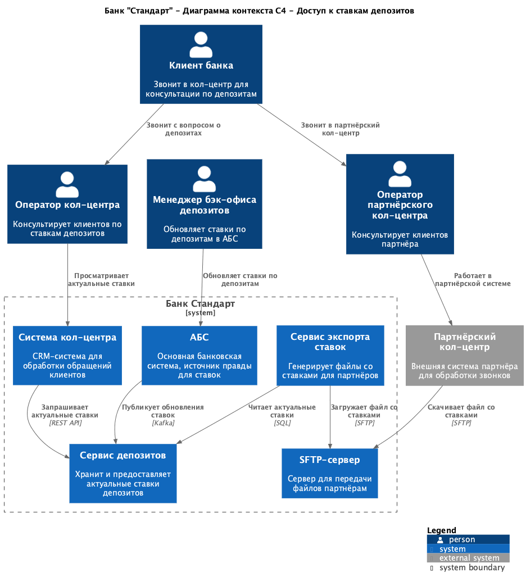
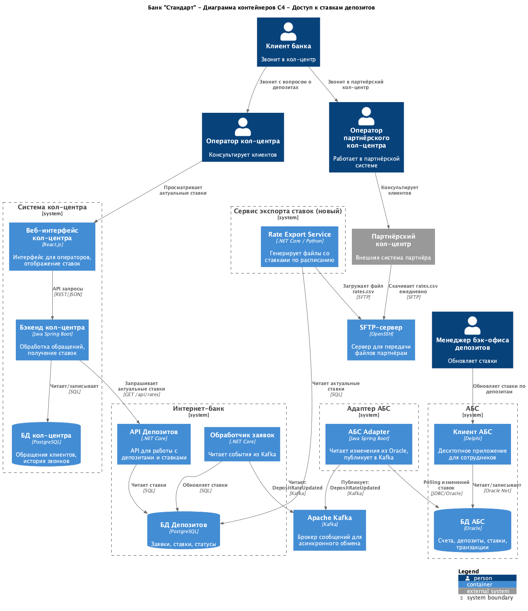
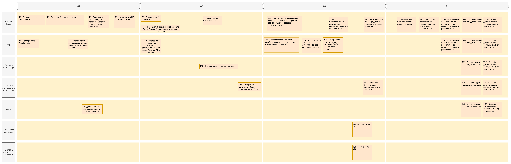

### **Название задачи:**

ADR "Предоставление доступа к ставкам депозитов для кол-центров"

### **Автор:**

Юдин Ярослав

### **Дата:**

07.12.2025

### **Функциональные требования**

<table>
<thead>
<tr>
  <th>№</th>
  <th>Действующие лица или системы</th>
  <th>Use Case</th>
  <th>Описание</th>
  <th>Комментарий</th>
</tr>
</thead>
<tbody style="vertical-align: top;">
<tr>
  <td>UC3</td>
  <td>Клиент, оператор кол-центра, система кол-центра, сервис депозитов</td>
  <td>Консультация по ставкам депозитов в кол-центре банка</td>
  <td>
    <ol style="margin: 0; padding-left: 1.2em;">
    <li>Клиент звонит в кол-центр с вопросом о депозитах.</li>
    <li>Оператор кол-центра открывает систему и видит список актуальных ставок по депозитам.</li>
    <li>Оператор консультирует клиента по условиям и ставкам.</li>
    <li>При необходимости оператор может создать заявку на депозит в системе.</li>
    </ol> 
  </td>
  <td>Требуется доступ к актуальным ставкам в режиме реального времени</td>
</tr>
<tr>
  <td>UC4</td>
  <td>Клиент, оператор партнёрского кол-центра, партнёрская система, SFTP-сервер</td>
  <td>Консультация по ставкам депозитов в партнёрском кол-центре</td>
  <td>
    <ol style="margin: 0; padding-left: 1.2em;">
    <li>Банк ежедневно передаёт актуальные ставки по депозитам партнёрскому кол-центру через SFTP в виде файла.</li>
    <li>Партнёрская система загружает файл со ставками.</li>
    <li>Клиент звонит в партнёрский кол-центр.</li>
    <li>Оператор партнёрского кол-центра консультирует клиента по актуальным ставкам из загруженного файла.</li>
    <li>Оператор может перенаправить клиента в банк для оформления депозита.</li>
    </ol> 
  </td>
  <td>Партнёрский кол-центр работает во внешней системе, доступ только через SFTP</td>
</tr>
<tr>
  <td>UC5</td>
  <td>Менеджер бэк-офиса депозитов, АБС, сервис депозитов</td>
  <td>Обновление ставок по депозитам</td>
  <td>
    <ol style="margin: 0; padding-left: 1.2em;">
    <li>Менеджер бэк-офиса рассчитывает новые ставки на основе ставки ЦБ и других факторов.</li>
    <li>Менеджер вносит обновленные ставки в АБС.</li>
    <li>Адаптер АБС публикует событие об обновлении ставок в Kafka.</li>
    <li>Сервис депозитов получает обновление и сохраняет новые ставки.</li>
    <li>Актуальные ставки становятся доступны для всех систем (ИБ, сайт, кол-центр).</li>
    </ol> 
  </td>
  <td>Единый источник правды — АБС, распространение через Kafka</td>
</tr>
</tbody>
</table>

### **Нефункциональные требования**

| **№**  | **Требование**                                                                     | **Комментарий**                                                          |
| :----: | :--------------------------------------------------------------------------------- | ------------------------------------------------------------------------ |
| **R**  | **Надёжность (Reliability)**                                                       |
|   R1   | Операторы кол-центра должны видеть актуальные ставки в режиме реального времени.   | Задержка не более 1 минуты после обновления в АБС                        |
|   R2   | Партнёрский кол-центр должен получать ставки минимум 1 раз в день.                 | Допустима задержка до 24 часов                                           |
| **S**  | **Безопасность (Security)**                                                        |
|   S1   | Передача ставок партнёрскому кол-центру должна быть защищена.                      | Использовать SFTP с SSH-ключами                                          |
|   S2   | Партнёрский кол-центр не должен иметь прямого доступа к внутренним системам банка. | Только чтение файлов через SFTP                                          |
| **P**  | **Производительность (Performance)**                                               |
|   P1   | Запрос ставок в системе кол-центра должен выполняться не более 500 мс.             |
| **+R** | **+ Ограничения (Restrictions)**                                                   |
|  +R1   | Партнёрский кол-центр не может делать API-вызовы, доступен только SFTP.            | Технические ограничения партнёра                                         |
|  +R2   | Ставки обновляются сотрудниками бэк-офиса депозитов в АБС вручную.                 | Частота обновления: 1-2 раза в день, иногда чаще при изменении ставки ЦБ |
|  +R3   | Система кол-центра полностью поддерживается подрядчиком (+R12).                    | Изменения возможны только через API, нельзя менять внутреннюю логику     |
|  +R4   | Текущие ставки хранятся в Excel-файлах у сотрудников бэк-офиса.                    | Нет централизованного хранилища ставок                                   |

### **Решение**

#### Архитектурные решения:

1. **Централизация хранения ставок** — Сервис депозитов становится единым источником правды для актуальных ставок (вместо Excel-файлов).

2. **Интеграция кол-центра через REST API** — Система кол-центра получает ставки через REST API сервиса депозитов в режиме реального времени.

3. **Интеграция партнёрского кол-центра через SFTP** — Создаём отдельный сервис экспорта (Rate Export Service), который:

   - Читает актуальные ставки из БД депозитов
   - Генерирует файл в нужном формате (CSV/JSON)
   - Размещает файл на SFTP-сервере по расписанию

4. **Распространение обновлений через Kafka** — При обновлении ставок в АБС событие публикуется в Kafka, сервис депозитов обновляет данные.

#### Диаграмма контекста

#### Диаграмма контейнеров

#### Обоснование решений:

1. **+R2, +R4** — Централизуем хранение ставок в Сервисе депозитов, отказываемся от Excel-файлов как источника правды.

2. **+R3** — Интеграция с системой кол-центра через REST API, так как подрядчик предоставляет возможность вызова внешних API.

3. **+R1** — Для партнёрского кол-центра создаём отдельный сервис экспорта ставок на SFTP, так как API-вызовы недоступны.

4. Используем Kafka для распространения обновлений ставок от АБС к сервису депозитов.

5. **S1, S2** — SFTP с SSH-ключами обеспечивает безопасную передачу данных без предоставления прямого доступа к внутренним системам.

6. **P1** — Кэширование ставок в сервисе депозитов и БД PostgreSQL обеспечивает быстрый доступ.

### **Альтернативы**

#### Альтернатива 1: Прямая интеграция партнёрского кол-центра через REST API

**Описание:** Вместо SFTP предоставить партнёру REST API для получения ставок.

**Плюсы:**

- Данные в реальном времени
- Меньше компонентов (не нужен Rate Export Service и SFTP)

**Минусы:**

- **+R18**: Партнёр не может делать API-вызовы (технические ограничения)
- Необходимость предоставления доступа к внутренним API банка (риски безопасности)

**Вердикт:** Не подходит из-за ограничения +R18.

#### Альтернатива 2: Email-рассылка ставок вместо SFTP

**Описание:** Отправлять актуальные ставки партнёру по email.

**Плюсы:**

- Проще реализация
- Не нужен SFTP-сервер

**Минусы:**

- Ненадёжный канал (письма могут попасть в спам)
- Ручная обработка файлов партнёром
- Сложность автоматизации

**Вердикт:** SFTP более надёжен и автоматизирован.

#### Альтернатива 3: Хранение ставок в АБС без сервиса депозитов

**Описание:** Сделать АБС единственным источником ставок, все системы обращаются к АБС напрямую.

**Плюсы:**

- Меньше компонентов
- АБС — единый источник правды

**Минусы:**

- База данных АБС уже перегружена, дополнительные запросы усугубят проблему
- Нарушает принцип изоляции микросервисов

**Вердикт:** Не подходит из-за перегрузки АБС.

### **Недостатки, ограничения, риски**

#### Недостатки:

1. **Дополнительный сервис** — Rate Export Service увеличивает количество компонентов для поддержки.
2. **Задержка для партнёра** — Партнёрский кол-центр получает ставки не в реальном времени (до 24 часов задержки).
3. **Ручное обновление ставок** — Сотрудники бэк-офиса должны вносить ставки в АБС, есть риск человеческой ошибки.

#### Ограничения:

1. **+R1** — Партнёрский кол-центр не может использовать API, только SFTP.
2. **+R3** — Система кол-центра поддерживается подрядчиком, изменения только через согласование.
3. Партнёр может видеть устаревшие ставки до 24 часов.

#### Риски:

1. **Риск несогласованности данных** — Если Kafka недоступна, ставки в сервисе депозитов могут отличаться от АБС.
2. **Риск перегрузки кол-центра** — Если маркетинговая кампания окажется слишком успешной, кол-центры могут не справиться.
3. **Риск сбоя SFTP** — Если SFTP-сервер недоступен, партнёр не получит обновлённые ставки.
4. **Риск утечки данных через SFTP** — Конфиденциальные данные могут быть скомпрометированы.
5. **Зависимость от подрядчика** — Изменения в системе кол-центра зависят от подрядчика (сроки, стоимость).

### Roadmap

