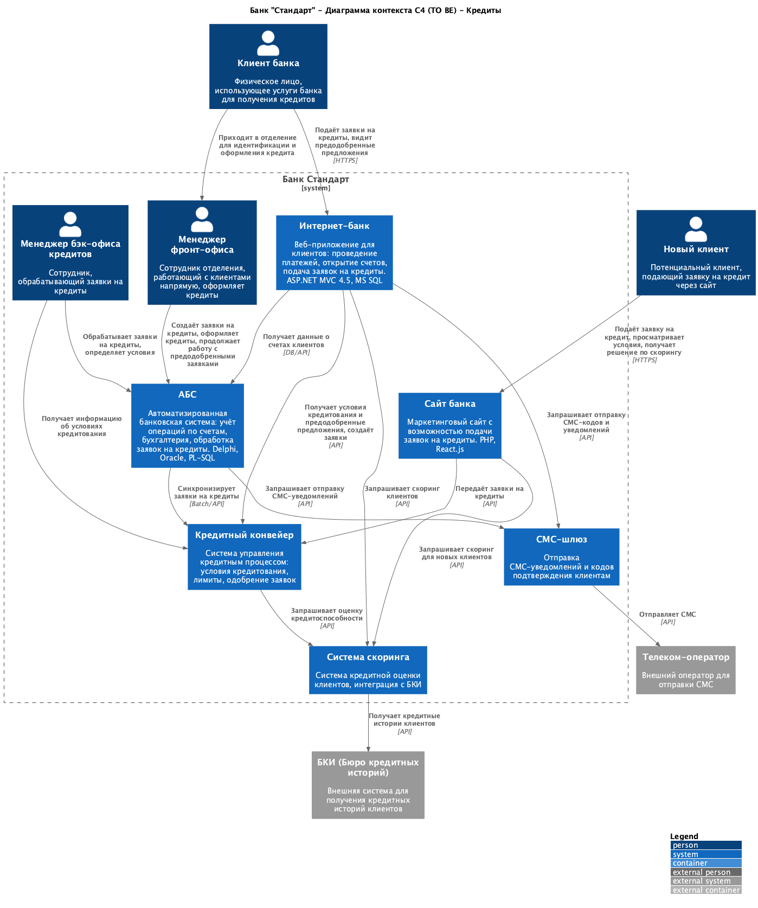
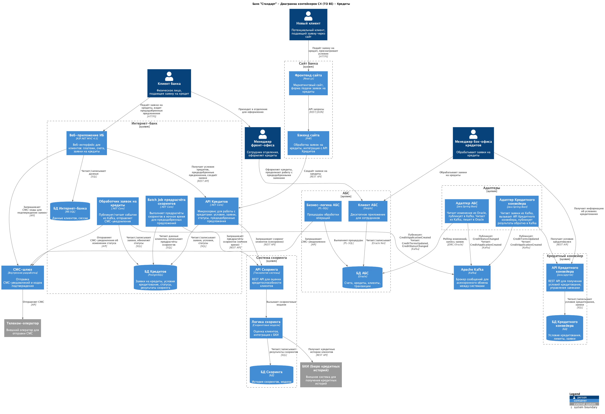

### **Название задачи:**

ADR "Заявка на кредит онлайн"

### **Автор:**

Юдин Ярослав

### **Дата:**

09.12.2025

### **Функциональные требования**

<table>
<thead>
<tr>
  <th>№</th>
  <th>Действующие лица или системы</th>
  <th>Use Case</th>
  <th>Описание</th>
  <th>Комментарий</th>
</tr>
</thead>
<tbody style="vertical-align: top;">
<tr>
  <td>UC1</td>
  <td>Новый клиент, сайт, БКИ, система скоринга, менеджер, СМС-шлюз</td>
  <td>Заявка на кредит через сайт</td>
  <td>
    <ol style="margin: 0; padding-left: 1.2em;">
    <li>На сайте новый клиент видит предложение открыть кредит по некоторой ставке.</li>
    <li>Клиент может подать заявку на кредит на сайте, оставив свой номер телефона и Ф. И. О.</li>
    <li>Если клиент ещё заполнит паспортные данные на сайте, то можно сразу выдать ему решение об одобрении или неодобрении кредита.</li>
    <li>Для этого нужно получить данные из системы скоринга. Так как клиент новый, можно использовать только общие данные бюро кредитных историй.</li>
    <li>После подачи заявки на кредит клиенту приходит СМС о том, что нужно прийти в отделение для получения кредита и идентификации.</li>
    </ol> 
  </td>
  <td>Объединяем требования F14-F18 в один Use Case</td>
</tr>
<tr>
  <td>UC2</td>
  <td>Менеджер фронт-офиса, клиент, АБС, кредитный конвейер</td>
  <td>Оформление кредита в отделении</td>
  <td>
    <ol style="margin: 0; padding-left: 1.2em;">
    <li>Если клиент придёт в отделение, там менеджер может подать заявку на кредит через АБС.</li>
    <li>Менеджер должен продолжить работать с той же заявкой на кредит, если клиент уже получил предварительное одобрение на сайте.</li>
    <li>Полная информация о возможных условиях кредита хранится в Кредитном конвейере.</li>
    </ol> 
  </td>
  <td>Объединяем требования F15, F19, F20 в один Use Case</td>
</tr>
<tr>
  <td>UC3</td>
  <td>Клиент, интернет-банк, система скоринга, кредитный конвейер, СМС-шлюз</td>
  <td>Заявка на кредит через интернет-банк</td>
  <td>
    <ol style="margin: 0; padding-left: 1.2em;">
    <li>В интернет-банке клиент видит список доступных кредитов с актуальными условиями так же, как и на сайте.</li>
    <li>Ещё в ИБ клиенту может выводиться предодобренное предложение по кредиту, если ранее по нему уже проводился скоринг.</li>
    <li>Клиент, указав счёт зачисления средств и данные для подачи заявки в ИБ, может отправить её в банк.</li>
    <li>Операция на подачу заявки на кредит в ИБ подтверждается СМС-кодом.</li>
    <li>После подачи заявки на кредит в ИБ - повторный скоринг (если уже был), если ситуация изменилась, но уже по упрощённой процедуре.</li>
    <li>Нужно информировать клиента по СМС об изменении статуса заявки на кредит.</li>
    </ol> 
  </td>
  <td>Объединяем требования F21-F26 в один Use Case</td>
</tr>
</tbody>
</table>

### **Нефункциональные требования**

| **№** | **Требование**                                                                                                                        | **Комментарий**                                                                                                                                           |
| :---: | :------------------------------------------------------------------------------------------------------------------------------------ | --------------------------------------------------------------------------------------------------------------------------------------------------------- |
| **R** | **Надёжность (Reliability)**                                                                                                          |
|  R1   | Все сервисы должны работать 24/7 и быть доступны в 99,9% случаев.                                                                     |
|  R2   | В случае сбоев в ЦОД необходимо, чтобы сервисы интернет-банка были доступны и выдерживали требуемую нагрузку.                         |
| **P** | **Производительность(Performance)**                                                                                                   |
|  P1   | Отклик по всем операциям должен быть максимально быстрым и занимать миллисекунды.                                                     |
|  P2   | Предусмотреть равномерное горизонтальное масштабирование и распределение запросов между серверами, приложениями и ЦОД.                |
|  +R   | **+ Ограничения (Restrictions)**                                                                                                      |
|  +R1  | При доработках во всех системах нужно как можно больше использовать технологии, которые уже есть в банке.                             | Например, базы данных MS SQL и Oracle. Можно развернуть новые технологии, но необходимо, чтобы они были совместимы с существующими платформами разработки |
|  +R2  | Можно развернуть новые технологии, но необходимо, чтобы они были совместимы с существующими платформами разработки.                   | Также желательно, чтобы внутри банка уже была экспертиза.                                                                                                 |
|  +R3  | Если нужны очереди сообщений, то лучше использовать Kafka на перспективу.                                                             |
|  +R4  | Cтоит учитывать, что текущая версия платформы интернет-банка несовместима с кафкой.                                                   |
|  +R5  | Cтоит подумать о переводе интернет-банка на микросервисную архитектуру.                                                               | Пока только в рамках задачи открытия депозитов и кредитов.                                                                                                |
|  +R6  | Лучше избежать прямой работы интернет-банка с API АБС в новом процессе.                                                               | База данных АБС уже перегружена.                                                                                                                          |
|  +R7  | Всё работает в одном ЦОД на одной группе серверов.                                                                                    | У банка есть резервный ЦОД, в случае сбоя можно переключиться на него.                                                                                    |
|  +R8  | АБС может масштабироваться только вертикально из-за своей базы данных.                                                                |
|  +R9  | Сейчас заявки попадают в Кредитный конвейер раз в сутки из АБС. При этом ускорить обмен между базами и проводить его чаще невозможно. | Необходимо обеспечить асинхронный обмен через Kafka.                                                                                                      |
| +R10  | Систему кредитного скоринга не нужно нагружать дополнительными процессами по предрасчетам скорингов в рабочие часы.                   | Предрасчёты скорингов лучше проводить в ночное время.                                                                                                     |
| +R11  | Обновление ядра системы интернет-банка привязано к подрядчику.                                                                        |
| +R12  | Система колл-центра полностью поддерживается подрядчиком.                                                                             | В команде АБС есть несколько специалистов с опытом в Java-стеке, они могут иногда вносить изменения самостоятельно.                                       |
| +R13  | Команда интернет-банка утверждает, что требования по доступности пока невыполнимы.                                                    |
| +R14  | Интернет-банк: Клиент-серверная система на веб-фреймворке ASP.NET MVC 4.5 на основе .NET Framework 4.5 и СУБД MS SQL.                 |
| +R15  | АБС: Интерфейс — десктопный клиент на Delphi и СУБД на Oracle. Основная логика работы - процедуры на PL-SQL в СУБД.                   |
| +R16  | Система кол-центра: интерфейс на React.js, бэкенд на Java Spring Boot и базы PostgreSQL, архитектура микросервисная.                  | Работает на технологиях подрядчика.                                                                                                                       |
| +R17  | Сайт: собственная разработка банка на PHP и React.js.                                                                                 |

### **Решение**

#### Диаграмма контекста

#### Диаграмма контейнеров

1. **+R1, +R2** — используем уже используемые технологии (.NET, MS SQL, Java), т.к. на данный момент они удовлетворяют нашим требованиям.
2. **+R6** — создаём новый микросервис в рамках интернет-банка, который будет отвечать за фоновую синхронизацию с Кредитным конвейером и системой скоринга.
3. **+R3, +R9** — для общения между системами используем Kafka. Это решает проблему с синхронизацией данных между АБС и Кредитным конвейером (раз в сутки → асинхронно в реальном времени).
4. **+R4** — создаём промежуточные адаптеры для систем, которые не поддерживают Kafka напрямую (АБС, Кредитный конвейер).
5. **+R10** — предрасчёты скорингов для предодобренных предложений выполняем в ночное время с помощью Batch Job.

#### Ограничения:

- **АБС (+R8)**: масштабируется только вертикально, Oracle Data Guard обеспечивает репликацию, но переключение может занять больше времени.
- **+R9**: батчевая синхронизация АБС ↔ Кредитный конвейер заменяется асинхронным обменом через Kafka.
- **+R10**: предрасчёты скорингов для предодобренных предложений выполняются в ночное время.
- **+R13**: команда ИБ считает требования по доступности невыполнимыми на текущий момент — новая архитектура с микросервисами позволит достичь 99.9% для сервиса кредитов независимо от монолита ИБ.
- **БКИ**: внешняя система, доступность зависит от провайдера, необходимо предусмотреть таймауты и retry-механизмы.
- **Система скоринга (+R10)**: не нагружать в рабочие часы предрасчётами — использовать Batch Job в ночное время.

### **Альтернативы**

#### Альтернатива 1: Прямая интеграция ИБ с Кредитным конвейером

Интернет-банк напрямую обращается к API Кредитного конвейера, без микросервиса кредитов и Kafka.

**Недостатки:**

- Нарушает принцип +R6 (перегрузка существующих систем)
- Нарушает принцип +R5 (переход на микросервисы)
- Тесная связанность ИБ с Кредитным конвейером
- Проблема +R9 остаётся (батчевая синхронизация АБС ↔ Кредитный конвейер)
- Невозможность горизонтального масштабирования

#### Альтернатива 2: Не использовать Kafka, только REST API

Все интеграции строить на основе синхронных REST вызовов между системами.

**Недостатки:**

- Нарушает принцип +R3 (использовать Kafka)
- Не решает проблему +R9 (батчевая синхронизация)
- Высокая связанность систем
- Низкая отказоустойчивость (синхронные вызовы требуют доступности всех систем одновременно)
- Сложность обработки ошибок и повторных попыток

#### Альтернатива 3: Доработать АБС для совместимости с Kafka

Вместо создания адаптеров, доработать АБС и Кредитный конвейер для прямой работы с Kafka.

**Недостатки:**

- Высокие риски и стоимость доработки legacy-систем (АБС на PL-SQL, Кредитный конвейер)
- Долгий срок реализации (более 12 месяцев)
- Требуется глубокая экспертиза в legacy-технологиях (PL-SQL, Oracle)
- +R11: зависимость от подрядчика для некоторых систем
- Риск нарушения работы существующих процессов

### **Недостатки, ограничения, риски**

1. **Дополнительная сложность архитектуры**: введение микросервисов, Kafka, адаптеров требует более высокой квалификации команды.
2. **Зависимость от внешних систем**: БКИ — внешний сервис, необходима обработка недоступности.
3. **+R10**: нагрузка на систему скоринга — необходимо тщательно планировать время выполнения предрасчётов.
4. **+R9**: старая проблема батчевой синхронизации АБС ↔ Кредитный конвейер решается, но требует создания адаптеров.
5. **Эволюционная архитектура**: пока не переводим все части системы на микросервисы, в дальнейшем потребуется доработка.
6. **Требования по доступности интернет-банка пока не выполняются**, но для целевого решения (12 месяцев) это приемлемо.
7. **Интеграция с Кредитным конвейером**: требует согласования API и форматов данных, возможны задержки.
